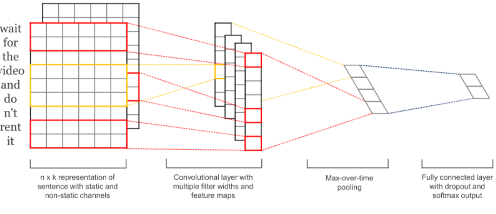
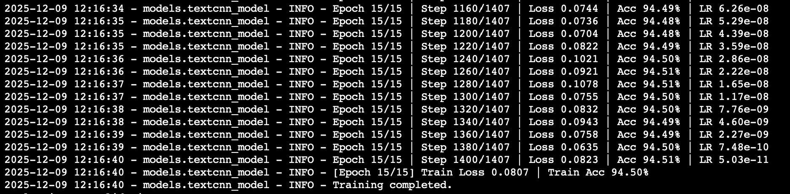
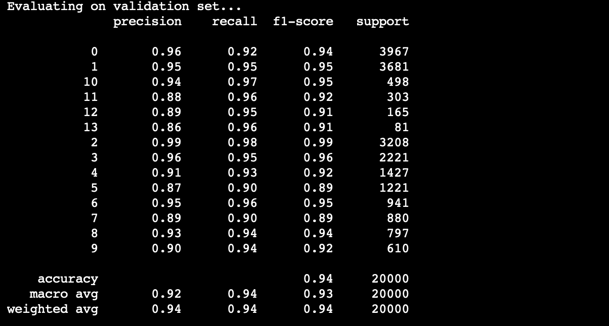
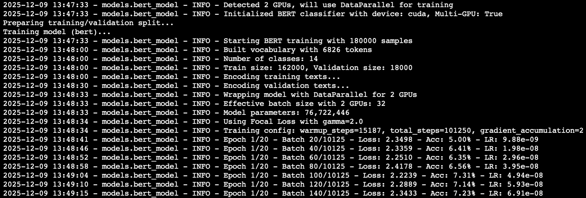
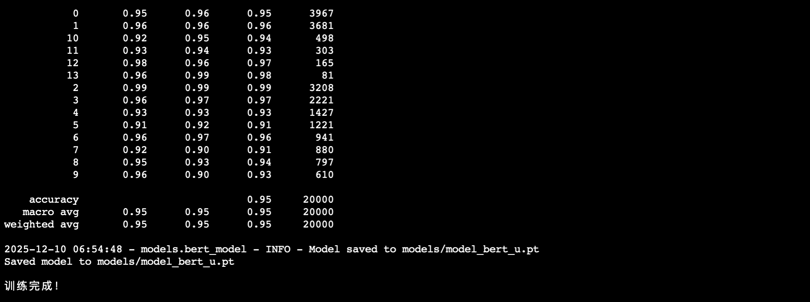

# tianchi-nlp-news-classification report

## 1 问题介绍

通过不同的机器学习模型对已经匿名化的新闻文本进行分类，并根据训练结果预测文本的新闻所属类型，从而实现新闻的自动分类

数据共分为三部分：20 万条训练集样本，以及各 5 万条样本的测试集 A、测试集 B

## 2 数据处理

* **train.py**:从指定 CSV 文件加载文本分类数据集，自动拆分训练 / 验证集；
* **data_utils.py**:
  * 自动加载 TSV（制表符分隔）格式的数据集，智能检测文本列、标签列；
  * 提供固定的类别名称与数字 ID 映射（如 “科技”→0、“股票”→1 等 14 个类别）；
  * 支持标签 ID 与名称的双向转换，以及预测结果的 CSV 保存。
* **机器学习模型**:通过SimpleTokenizer（数字分词器）实现将空格分隔的数字序列文本转换成固定长度的 token ID。

操作后数据便转换为模型所需的Token了。

## 3 模型 && 训练

本次实验中采取若干种模型结构进行训练，并在部分模型上进一步调优。在选择模型调优之前，需要先对比几种模型训练结果的基准表现，选取较为优秀、有进步空间的模型进行调整。

### 3.1 训练textCNN模型

#### 3.1.1 textcnn方案

##### 模型

* **SimpleTokenizer（数字分词器）**：将空格分隔的数字序列文本，先统计高频数字 token 构建词表（给每个数字分配唯一 ID，预留 PAD/UNK），再把文本转换成固定长度的 token ID 序列（超长截断、超短补 PAD）。
* **TextDataset（文本数据集）**：封装 token ID 序列和标签，按索引返回单条样本（包含 input_ids 和可选 labels），适配 PyTorch 数据加载逻辑。

* **textcnn_model**:
  * **嵌入层（Embedding）**：把 token ID 转换为稠密向量（embedding_dim 维度），忽略<PAD>的向量更新；
  * **卷积层（Conv1d）**：多尺寸卷积核（如 2/3/4/5）提取不同长度的文本特征（类似 N-gram）；
  * **池化层（MaxPool1d）**：对卷积结果取最大值，保留关键特征；
  * **分类层（Linear）**：拼接所有卷积核的池化结果，映射到类别数维度。

下图为TextCNN模型的示意图，从左至右依次为嵌入层、卷积层、池化层与分类层


* **FocalLoss（聚焦损失）**：基于交叉熵损失，通过 (1-pt)^gamma 调制因子，降低易分类样本权重、聚焦难分类样本（解决类别不平衡）。
* **TextCNNModel（模型适配器）**：
  * **_select_hyperparams（动态调参）**：根据训练集文本长度（95% 分位数）调整 max_length，按词表规模调整 embedding_dim，按文本中位数长度调整卷积核尺寸。
  * **fit（训练流程）**：统计文本长度 / 构建词表→编码标签→划分训练 / 验证集→初始化模型 / 优化器 / 调度器→根据类别不平衡比选择损失函数→训练循环（前向计算损失、反向传播更新参数、梯度累积、验证集评估）。
  * **_evaluate（评估函数）**：无梯度计算模式下，遍历验证集计算损失和分类精度。predict（预测）：将文本编码为 token ID→模型输出 logits→取 argmax 得到类别 ID→解码为原始类别名。
  * **predict_proba（概率预测）**：模型输出 logits 后用 softmax 归一化，得到每个类别的概率值。
  * **save/load（模型保存 / 加载）**：保存模型参数、分词器词表、标签编码器、超参数配置；加载时恢复所有状态，适配多 GPU / 单 GPU 环境。

#### 3.1.2 训练参数

```bash
python main.py train --model-spec textcnn --epochs 15 --batch-size 128 --learning-rate 1.5e-4 --dataloader-num-workers 4 --model-out models/textcnn.pt
```

#### 3.1.3 训练过程





#### 3.1.4 结果

得分92.98。

### 3.2 训练transformer模型

transformer 模型广泛的运用在各种模型中，可以处理自然语言等顺序输入数据，适用于机器翻译、文本摘要等任务。

#### 3.2.1 transformer方案

##### 模型

* **Embeddings**：输入的单词（或 token）转换成数字向量（比如 "猫" → [0.2, -0.5, 0.7…]）。
* **encoder**

  * **Multi-Headed Self-Attention（多头自注意力）**：让模型同时关注输入中的所有单词，并计算它们之间的关系。
  * **Norm（层归一化）**：稳定训练过程，防止数值过大或过小（类似"调音量"到合适范围）。
  * **Feed-Forward Network（前馈神经网络）**：对每个单词的表示进行进一步加工（比如提取更复杂的特征）。
* **decoder(X)**
* **masked mean pooling**

  * 把 `[B, L, D]` 的 token 表示，用 mask 把 PAD 位置的向量清零，按 mask 对非 PAD 位置做平均，
    得到一个 `[B, D]` 的句向量，作为这条样本的整体表示。
* **classifier MLP**

  * 最终输出分类结果(softmax后的argmax)

下图为完整的transformer，此处的transformer去除了decoder，因为在分类任务中如果保留decoder和自回归性质进行prefill的话反而容易引起不必要的麻烦，对于分类来说是额外复杂度和算力开销，而难以提升准确率。

**（这个改造过的模型实际上已经和 BERT 模型很接近了，所以这里考虑使用更成熟的 BERT 模型为基准，不再对transformer进行改造）**


#### 3.2.2 训练参数

此处的训练参数是测试性质的，没有发挥其全部威力。

```python
vocab_size: int = 8000
d_model: int = 256,
nhead: int = 8,
num_layers: int = 4,
dim_feedforward: int = 1024,
dropout: float = 0.1,
max_length: int = 512
```

#### 3.2.3 结果

得分91.58。

### 3.3 训练 BERT 模型

#### 3.3.1 BERT 方案

选择 BERT 模型的原因是其结构广泛的用于分类任务中，可以支撑大数据量、长输入的训练。

##### 模型

BERT 模型具有以下架构：

* 嵌入层 **Embedding** 后加正弦/余弦 **PositionalEncoding**，形成 **[batch, seq_len, d_model]** 输入。
* 堆叠 **num_layers** 个 Transformer 编码层：每层是多头自注意力 (**MultiHeadAttention**) + 前馈两层全连接 (**FeedForward**)，各自带残差和 **LayerNorm**。
* 注意力mask来自padding（**attention_mask**），避免对pad位置计算权重。
* 分类头取 **[CLS]** 位置向量，经 **tanh(pooler)** + dropout + 全连接输出 **num_labels** 维 logits。
* 最后通过取 softmax 得到输出概率列表。


##### 动态学习率

```python
# Warmup (前15%步数线性增长)
if step < warmup_steps:
    lr = base_lr * (step / warmup_steps)

# Cosine Decay (后续余弦衰减)
else:
    progress = (step - warmup_steps) / (total_steps - warmup_steps)
    lr = base_lr * 0.5 * (1 + cos(π * progress))
```

##### Focal Loss

```python
# 标准交叉熵: 所有样本权重相同
loss = -log(p_t)

# Focal Loss: 难样本权重更大
loss = -(1 - p_t)^γ * log(p_t)

# 当p_t高(易分类): (1-p_t)小，loss被降权
# 当p_t低(难分类): (1-p_t)大，loss被加权
```

实现如下：

```python
# 计算交叉熵
ce_loss = F.cross_entropy(inputs, targets, reduction='none', label_smoothing=self.label_smoothing)
# 计算概率
pt = torch.exp(-ce_loss)
# Focal loss
focal_loss = ((1 - pt) ** self.gamma * ce_loss).mean()
```

##### 多轮推理(TTA)

```python
# 启用dropout进行多次推理
model.train()  # 启用dropout
predictions = []
for _ in range(5):
    pred = model(x)
    predictions.append(pred)

# 平均预测
final_pred = mean(predictions)
```

##### 梯度累积

```python
# 实际batch=16，累积2步
# 等效batch=32，减少内存占用
for step in range(0, len(data), 16):
    loss = model(batch) / 2
    loss.backward()
    if (step + 1) % 2 == 0:
        optimizer.step()
        optimizer.zero_grad()
```

##### 标签平滑

原始: [0, 0, 1, 0, 0]

平滑: [0.007, 0.007, 0.964, 0.007, 0.007]

效果: 减少过拟合，提升泛化

#### 3.3.2 训练参数与调参

```python
vocab_size = 7000              # 更大词汇表覆盖 (6000->7000->7000)
d_model = 768                  # BERT-base级别 (512->768->768)
num_layers = 10                # 更深 (6->8->10)
num_heads = 12                 # 更多注意力 (8->10->12)
d_ff = 3072                    # 4倍模型维度 (2048->3072->3072)
max_length = 2560              # 覆盖95%样本 (512->1024->2560)
dropout = 0.2                  # 优化过拟合 (0->0.1->0.2)
batch_size = 16                # 配合梯度累积
learning_rate = 1.2e-5         # 更稳定 (1e-4->2e-5->1.2e-5)
epochs = 20                    # 充分训练 (10->15->20)
warmup_ratio = 0.15            # warmup步数 (0->0.1->0.15)
label_smoothing = 0.1          # 标签平滑 (0->0.1->0.1)
gradient_accumulation = 2      # 有效batch=32 (0->2->2)
```

* 参数调整

注释中标记了3次主要训练中的参数调节过程，总体变化趋势是参数量逐渐增大，实际上进行了不止3次训练，但报告中选取能造成表现较显著进步的训练参数进行调参报告。

* 第一次训练参数较为保守，同时没有对 loss, label, infer, lr 进行优化改造，所以不少参数还是0。
* 第一次训练测试结果为0.91。
* 第二次训练在采取优化后进行训练，同时最大的变化是增加模型深度和注意力头数，并降低学习率，启用动态学习率，推测这3项变化对测试结果的提升最为明显。
* 第二次训练测试结果为0.94。
* 第三次训练最主要增加了最大长度，做到覆盖所有样本，并小幅增加了训练epoch。
* 第三次训练测试结果为0.95。

#### 3.3.3 训练过程




#### 3.3.4 训练结果

最优为95.05。

### 3.4 从 BERT-base 模型继续训练

#### 3.4.1 方案

典型的 BERT 模型需要经过预训练和下游微调两个阶段。也就是在 HF 中加载预训练的 BERT，再进行微调分类头。本次实验中同样测试了这种方案。

这种方法实际执行下效果非常差，若干轮训练后准确率只有0.3，远远不如直接训练的收敛速度。可以猜测原因如下：

##### BERT 对数字密文其实毫无先验，微调收益非常有限

* 预训练模型：`bert-base-chinese`
* 输入： **经过加密的数字 token** ，和自然语言完全没关系

从 BERT 视角看：预训练的 embedding 和 encoder 层里语义知识的几乎派不上用场；且在大量位置上还需要用随机初始化的新 token embedding；这本质上是在用一个带着一堆“无关先验”的网络去学习一堆随机编号序列上的分类问题。

所以才会导致收敛更难，初始阶段模型对这些 token 的表示是纯随机的，需要大量数据 + 训练步数才能把 embedding 和高层适配好。同时内容加密其实也把 BERT 能利用的语义信息全抹掉了。

### 3.5 从 BERT 模型集成学习

#### 3.5.1 方案

有两种方法得到集成学习的结果，方法一串行训练若干个模型，可以指定模型类型为集成学习的模型(bert_ensemble)：

```bash
python main.py train --model-spec bert_ensemble --epochs 20 --batch-size 8 --learning-rate 1.5e-5 --model-out models/bert_ens.pt
```

方法二是通过已有的模型文件进行集成推理，这种方法是并行的：

```bash
python infer_bert_ensemble.py \
  --models models/bert_a.pt models/bert_b.pt models/bert_c.pt \
  --input-csv data/test_a.csv \
  --output-csv predictions.csv \
  --use-tta --tta-rounds 5   # 可选
```

在实际操作时，受限于显存的大小与训练成本，最终没有选择串行训练的方法，而是直接通过 BERT 方案中训练的 3 个模型进行并行推理。

#### 3.5.2 结果

获得了最佳结果，准确率在 0.9557，相较于 3 个模型单独推理提升了 0.5%～1%，符合预期。（显示成绩结果13/0.96）

#### 3.5.3 结果分析

实际上，从 3 个模型单独的推理结果进行数据分析，发现两两之间不同结果数的占比能达到3%。

这意味着虽然这 3 个模型都是通过 BERT 模型架构、相同的数据训练出来的，实际上在推理中的结果却并不会收敛到相同的值。由于这 3 份推理结果的错误率均只在 5% 左右，此处不同的推理结果极有可能造成并行推理带来提升，目前的提升是在预期之内的，也有可能通过不同的概率组合达到更高的提升。


|                                         | 不同的行数 | 总行数 | 不同占比 |
| --------------------------------------- | ---------: | -----: | -------: |
| `predictions_1` vs `predictions_3` |       1620 |  50000 |    3.24% |
| `predictions_1` vs `predictions-2`  |       1691 |  50000 |   3.382% |
| `predictions_3` vs `predictions-2` |       1624 |  50000 |   3.248% |
